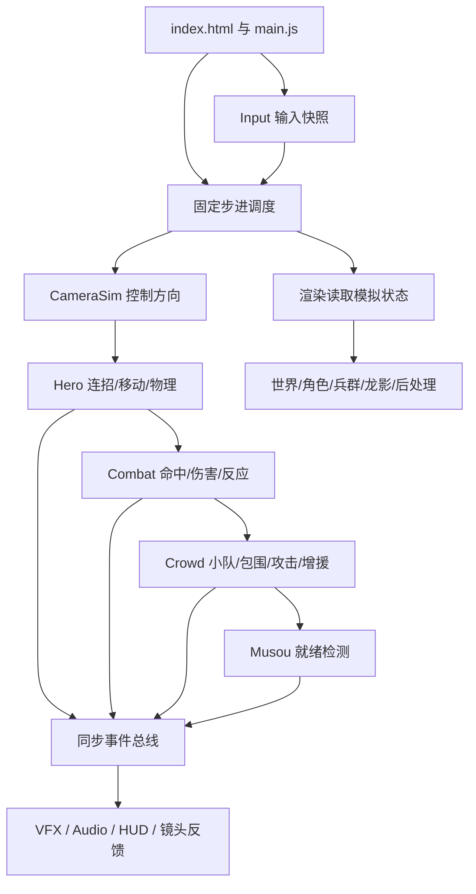
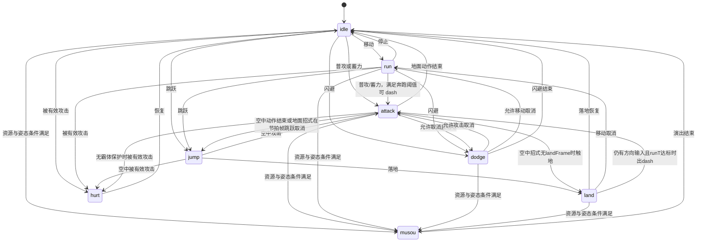
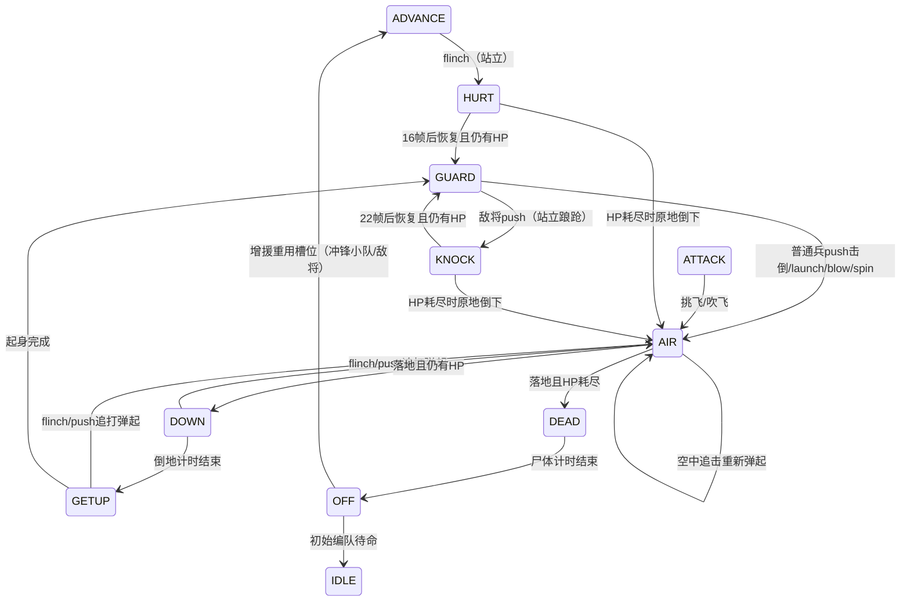

# Voxel Musou — 赵云：软件详细设计（SDD）

> 版本：1.1 ｜日期：2026-09-27（按固定提交源码复核修订）｜目标读者：Luna 开发代理与代码评审者<br>
> 需求依据：[voxel-musou-PRD.md](./voxel-musou-PRD.md)，版本 0.2<br>
> 源码基线：[mike007jd/voxel-musou](https://github.com/mike007jd/voxel-musou/tree/5702d9078d664974527ae3defe5aef49a5c4ed46)，提交 `5702d9078d664974527ae3defe5aef49a5c4ed46`

## 0. Luna 使用说明

本设计指导实现 PRD 描述的单角色、单战场、持续增援的浏览器动作演示。完成标准是覆盖 FR-01～FR-12、NFR-01～NFR-05，并通过第 13 节验收。

**采用上游固定提交作为实现基线。** 该提交已包含 PRD 的主要功能，Luna 应先运行和检查，再补齐交付所需的验证与明确缺口。若目标工程为空，先导入该快照及许可证；若已有工程，先检查其状态并保留用户改动。本文中的目录均为目标工程相对路径。

本文将信息分为三类：

- **基线规则**：源代码中已确认的玩法、数值和接口，复现时必须保持。
- **设计约束**：保证各模块正确协作的契约、顺序、状态所有权和验证要求。
- **交付补充**：测试入口、错误提示和验证记录等工程要求；本设计不声称上游已经具备这些能力。

当前主分支已与 PRD 的固定提交不同。不要将最新主分支中的 API 或数值直接混入本设计。出现差异时，按“用户明确变更 > PRD 的产品行为 > 本文的设计约束 > 固定提交的实现细节”处理；同级冲突需记录原因并修正文档与测试。

本文件是详细设计和开发交接文档，尚未执行产品代码开发，也未通过实际运行来证明全部测试。

## 1. 技术方案与范围

### 1.1 方案选择

| 方案 | 成本与风险 | 结论 |
| --- | --- | --- |
| 沿用固定提交，补验证与必要修正 | 保留已有动作、模型、特效与数值；接口变动小，便于核对 PRD | 采用 |
| 按本 SDD 从零重写相同模块 | 需重建角色动画、兵群、龙影和音画调校；外观和手感偏差较大 | 仅在用户明确要求独立重写时采用 |
| 引入新引擎、框架或构建链 | 增加迁移与部署成本，改变无需构建的约束 | 本轮不采用 |

### 1.2 技术栈

- 运行时：浏览器原生 JavaScript ES Modules、DOM、Canvas 2D、WebAudio、WebGL2。
- 图形：本地提供的 Three.js r186 及所需 addons，通过 `index.html` 的 importmap 解析。
- 托管：任意静态 HTTP 服务；可用 `python3 -m http.server 8000` 启动。
- 测试：交付补充采用浏览器内 ES Module 测试页，不为生产运行引入打包器或 npm 依赖。
- 网络与持久化：游戏启动后的规则不依赖后台 API；本轮不提供账号、联网对战、存档或数据库。

### 1.3 必须保持的产品边界

| 项目 | 设计决定 |
| --- | --- |
| 角色/场景 | 赵云一名可玩角色；黄昏城池战场 |
| 模式 | 持续战斗，无胜利、失败与成绩结算 |
| 主角生命 | 初始 400，最低 1 |
| 敌军容量 | 默认普通兵槽位 300，额外敌将槽位 4 |
| 无双槽 | 逻辑上限 100，显示三段，消耗一段即可发动一次 |
| 控制 | 键鼠主要输入；标准映射手柄可选 |
| 性能 | 逻辑固定 60 Hz；渲染 FPS 必须实测，不承诺未验证的数值 |

PRD 第 6 节的通关目标、主角死亡、移动端、成长、排行榜和语言设置均不纳入本轮实现。城门是场景元素与地图标识，不构成护送终点或通关触发器。

## 2. 总体架构

### 2.1 分层与依赖



图中箭头表示调度与信息流。`Hero` 在无双状态下调用 `Musou.stepHero()`，`Crowd` 在敌人出手帧调用 `Combat.enemyStrike()`；这两处是有意保留的规则协作，不应新增反向的渲染依赖。

### 2.2 状态所有权

| 状态 | 主写入者 | 允许的协作写入 | 读取者 |
| --- | --- | --- | --- |
| 主角位置、速度、动作 | Hero/Combo/Locomotion | Musou 控制主角演出；Combat 经 `hero.hurt()` 触发受伤 | Camera、HeroView、HUD、VFX、Audio |
| 敌军位置、状态、生命 | Crowd | Combat 写受击与反应物理；Musou 发动时写清场推移 | CrowdView、Camera、HUD、VFX |
| HP、无双资源、连击、KO | Hero 与 Combat | Musou 扣减资源 | HUD、Audio、VFX |
| 控制镜头 yaw | CameraSim | 重置入口 | 移动、AI、CameraRig、HUD、Audio |
| `frame/hitstop/freeze` | 主循环及规则模块 | Hero 消耗 hitstop；Crowd 消耗 freeze | 所有计时模块 |
| Three.js 对象、粒子、DOM、音频节点 | 对应表现模块 | 表现模块间只交换表现信息 | 渲染调度 |

**约束：表现模块不得修改玩法状态、消耗模拟 RNG 或触发伤害。** 上游 `game.hudTagR` 属于表现协作用的标记距离，不属于战斗规则；确定性快照应排除它。

### 2.3 目录职责

```text
index.html                 canvas、importmap、HUD/菜单 DOM 与样式
src/main.js                初始化、渲染调度接线、暂停、resize
src/core/loop.js           [交付补充] 从main抽出的固定步进调度（纯逻辑，无DOM）
src/core/input.js          键鼠/手柄 -> 每步输入快照；[交付补充] dispose()与可注入的手柄来源
src/core/events.js         同步事件总线
src/core/rng.js            模拟 RNG、视觉 RNG、稳定 hash
src/core/voxel.js          程序化几何生成与合并
src/hero/hero.js           主角状态与动画采样；主角视图工厂
src/hero/locomotion.js     移动、跳跃、闪避、主角物理
src/hero/combo.js          输入缓冲、连招分支、取消与突进
src/hero/moves.js          招式数据与动画时间重映射
src/hero/rig.js            姿态、骨架与枪尖世界位置
src/hero/model.js          体素角色外形
src/hero/anims/*           普通、蓄力及移动动画
src/hero/secondary.js      次级摆动表现
src/combat/combat.js       判定、伤害、KO、敌人反应物理
src/combat/hitfx.js        受击材质与姿态表现
src/crowd/crowd.js         敌人数组、小队、包围、令牌与增援
src/crowd/view.js          兵群 InstancedMesh 与姿态
src/musou/musou.js         无双时间线、命中、轨迹、镜头描述
src/musou/view.js          龙影、特写与无双表现
src/camera/camera.js       控制镜头状态、实际摄影机与反馈
src/camera/occlusion.js    遮挡淡出与镜头前景处理
src/world/*               地面、天空、城池、火焰与旌旗
src/vfx/vfx.js             攻击轨迹、命中、碎块与粒子池
src/post/post.js           渲染器、雾霭、景深、泛光与最终合成
src/audio/*               程序化声音库、事件音效与混音
src/ui/hud.js              状态读取、标签投影、小地图与提示
vendor/three/*            固定版本 Three.js
tests/index.html           [交付补充] 模块测试入口
tests/harness.js           [交付补充] 无表现层的模拟组装与断言
tests/cases/*.js            [交付补充] 核心规则测试
docs/verification.md        [交付补充] 人工验收与性能记录
```

保留上游文件边界即可开展首轮实现；没有具体测试或功能需要时，不进行全仓重构。例外是 `src/core/loop.js`：T16 需要在无DOM环境复用生产调度，因此把 main.js 中内联的 rAF 累加/补步/暂停逻辑抽成该模块，main.js 只负责接线，行为须与基线逐步一致。

## 3. 初始化、时钟与生命周期

### 3.1 初始化顺序

1. 读取 URL 的普通兵数量，取得 `#c`、`#hud`、`#menu`、`#go`。
2. 创建渲染器/后处理、Scene 与 World。
3. 创建 `game = { frame: 0, hitstop: 0, freeze: 0 }`。
4. 按 `cam -> hero -> crowd -> combat -> musou` 顺序挂载模拟模块。Combat 创建时依赖 Crowd 的容量。
5. 创建 Input、主角/兵群视图、CameraRig、VFX、MusouView、HUD、Audio。
6. 设置模拟 RNG seed=1、视觉 RNG seed=7936；重置主角、兵群、战斗、无双和控制镜头；生成军队。
7. 发出 `scenario: { name: 'arena' }`，进入暂停首屏，渲染一帧，启动 rAF。

`scenario` 是事件名，payload 中的 `name` 是场景名称；不要误实现为 `scenario:arena` 事件。

### 3.2 固定步进

基础单位：坐标使用世界米；速度为米/秒；角度使用弧度，招式 `ang/dir` 为度；规则时间为整数模拟帧，`DT = 1/60` 秒。

```js
// 调度伪代码；与基线次序一致。
function step() {
  const inp = input.sample();
  game.cam.step(game, inp);
  game.hero.step(inp);
  game.combat.step();
  game.crowd.step();
  game.musou.step();
  game.frame += 1;
  vfx.afterStep(); // 只采样枪尖与视觉数据
}

// 每次 rAF：elapsed 限制在 [0, 0.1] 秒。
// 暂停时清空累计时间并丢弃输入边沿。
// 每次 rAF 最多补跑 4 个固定步；达到 4 步后丢弃积压。
// 完成固定步后调用一次 render()。
```

保持此顺序的原因：镜头先确定控制方向；主角更新动作后，Combat 读取新的招式帧；敌军随后做 AI/攻击；最后检测无双就绪边沿。改变次序会影响招式首次命中帧与受击打断结果。

当设备长时间低帧率时，最多补跑 4 步的策略可能令游戏时间落后于墙钟时间；这与“固定 60 Hz 规则”并不冲突。确定性测试比较相同输入下的相同模拟步数，不比较两次墙钟运行的结果。

`src/core/loop.js` 契约（交付补充）：

```js
createFixedLoop({ step, render, sampleInput, maxSteps = 4, dt = 1 / 60, maxElapsed = 0.1 })
  -> { tick(elapsedSeconds), setPaused(bool), paused, stats }
// tick：夹紧 elapsed，暂停时清零累计并调用 sampleInput() 丢弃边沿；
// 否则最多执行 maxSteps 次 step()，达到上限清空积压，最后调用一次 render()。
// stats 记录本次补步数与是否丢弃积压，供 T16 断言。
```

main.js 用 `performance.now()` 差值调用 `tick`；测试用 `driveRenderSchedule` 传入人工时间序列。

调度确定性还必须覆盖 rAF 层：用稳定与不规则的渲染时间序列驱动同一份按模拟步编号的输入脚本，在达到相同模拟步数时比较规则快照。另分别验证单次 rAF 最多补跑4步、超过上限后清空积压、一次输入边沿在补帧中只消费一次，以及暂停清空累计时间并消费待处理边沿、恢复后不重放。

### 3.3 三种暂停/冻结

| 机制 | 停止内容 | 继续内容 |
| --- | --- | --- |
| 菜单暂停 | 全部模拟步进；`game.frame` 不增长 | DOM 菜单和浏览器输入采集 |
| `game.hitstop` | 主角的动作/物理更新；Combat 不重复处理同一招式帧 | 全局步数和其他未冻结模块；输入先缓冲 |
| `game.freeze` | 无双前半段的敌军 AI 与反应更新 | 主角无双时间线、清场推移与表现 |

不要把 hitstop 实现成全局停止 rAF。无双还会延长主角无敌状态，避免演出中受伤。

### 3.4 暂停与输入恢复

- Enter 或按钮进入/继续；Esc 切换；窗口失焦强制暂停，不自动继续。
- 暂停时显示菜单并隐藏战斗 HUD；恢复不重新生成军队。
- 菜单期间丢弃 `pressed` 边沿和镜头拖动增量；开始按钮点击不同时触发普通攻击。
- 失焦清除键盘/鼠标按住状态及拖动状态，避免恢复后持续移动或转镜头。
- 手柄仍持续按住攻击时，恢复后须等松开再按才产生新的攻击边沿。

最后两项是输入恢复的交付检查点。**已确认的基线缺陷**：固定提交 `input.js` 的 blur 只清除 `keys` 与 `held`，未清除 `drag`，也不处理窗口外松开鼠标；拖动镜头时切出窗口，返回后不按键移动指针仍会旋转镜头。须在输入模块内修正（blur 与 `pointercancel` 清除 `drag` 和 `orbitPx`，并用 `buttons===0` 的 pointermove 兜底结束拖动），并加入 T01 回归用例。手柄按住跨越暂停的情况在基线已满足：暂停期间每帧 `sample()` 会轮询手柄并消费边沿。

## 4. 数据模型与公共接口

### 4.1 输入快照

```js
// 说明性类型；生产仍使用原生 JS，可用 JSDoc 表达。
InputSnapshot = {
  mx: Number, my: Number,       // 摇杆/键盘合成方向，长度 <= 1
  orbit: Number,               // 本步镜头旋转增量
  pressed: { attack, charge, jump, dodge, musou }, // Boolean 边沿
  held: { attack, charge, jump, dodge, musou }     // Boolean 按住
};
```

`pressed` 在两个模拟步之间先锁存，再被下一次 `sample()` 消费；键盘 repeat 不生成攻击边沿。`CameraSim.step()` 会原地修正 `mx/my` 以保持控制方向，后续模块读取修正后的同一份快照。

### 4.2 主角模型

| 字段组 | 字段与约束 |
| --- | --- |
| 位姿 | `x,y,z,vx,vy,vz,yaw`；地面为 y=0 |
| 资源 | `hp,hpMax=400,musou,musouMax=100`；`1 <= hp <= hpMax`，`0 <= musou <= 100` |
| 动作 | `state,stateT,move,moveT,moveSeq,moveF0`；attack 状态须有有效 move |
| 移动 | `grounded,speed,runT,runPhase,iframes,dodgeX,dodgeZ,dodgeSeq` |
| 连击 | `combo,comboT,kos`；KO 按敌人生命期只计一次 |
| 缓冲 | `buf,bufT,bufW,dodgeBuf,dodgeW,jumpBuf,jumpW,musouBuf` |
| 空中 | `airN,airAttack,moveAir`；单次跳跃空中攻击上限 10 |
| 表现采样 | `anim`、`musouClip,musouT`；从模拟帧确定姿态，渲染不反写规则 |

### 4.3 敌军数据布局

采用 Struct of Arrays（SoA）：同一个敌人索引 `i` 访问各字段数组。容量 `N = grunts + 4`；`[0,grunts)` 为普通兵槽位，`[grunts,N)` 为敌将槽位。

- `Float64Array(N)`：位置、速度、yaw、hp/hpMax、反应旋转、目标半径等连续量。
- `Int32Array(N)`：`st/stT/type/kind/token/cd/hs/flash/lastHit/kod/squad/form/feint` 等状态与标记。
- Combat 自有 `Uint8Array` 保存浮空类型和重击标记。
- 小队表容量 64，包含 `x,z,face,st,t`；成员保存小队索引和编队局部坐标。
- `type` 仅区分普通兵/敌将；`kind` 区分枪兵、刀盾兵、队长、旗手、敌将。

不要为每名敌人创建独立 Three.js Scene 子树作为规则数据；表现层通过实例化绘制共享几何体。

### 4.4 基线公共接口

| 工厂/函数 | 参数 | 返回与契约 |
| --- | --- | --- |
| `createInput()` | 无 | `{sample()}`；每步一次输入采样。基线在 window 上注册全局监听且不可注销；交付补充 `createInput({ target = window, getGamepads } = {})` 返回 `{sample, dispose}`，缺省参数时行为与基线一致 |
| `createCamSim()` | 无 | `reset(yaw),step(game,inp),yaw,ctrl` |
| `createHero(game)` | 模拟聚合对象 | 主角字段；`reset(options),step(inp),hurt(dmg,fromX,fromZ,officer):boolean` |
| `createCrowd(game,grunts)` | 普通兵容量 | SoA 字段数组集合对象（含 `N/grunts/sq`）；`reset(),spawnArmy(count),spawnRing(count,radius),clear(),nearest(x,z,maxR,yaw,cone),counts(),releaseToken(i),step()` |
| `createCombat(game)` | 已有主角与兵群 | `reset(),step(),strike(hit,ox,oz,yaw,key,rehit,moveId):number,enemyStrike(i)` |
| `createMusou(game)` | 模拟聚合对象 | `reset(),ready():boolean,start(inp),stepHero(inp),step(),shot(),toWorld(p,out)` |
| `createHeroView(scene,hero)` | Scene 与主角 | `reset(),update(dt)` |
| `createCrowdView(scene,game)` | Scene 与模拟 | `update(dt)` |
| `createCameraRig(game,w,h)` | 模拟与视口 | `camera,focus,resize(w,h),update(dt)` |
| `createWorld(scene)` | Scene | `sunDir` 等世界表现对象；`update(dt,focus)` |
| `createVfx(scene,game,world)` | 表现依赖与模拟 | `flash,afterStep(),update(dt)` |
| `createMusouView(scene,game,camera)` | Scene/模拟/摄影机 | `update(dt)` |
| `createHud(root,game,{camera})` | DOM 根、模拟、摄影机 | `update()`；第三参数是 options 对象 |
| `createPost({canvas,enabled,width,height})` | canvas 与尺寸 | `renderer,bloom,enabled,setSize(w,h),flash(v),render(scene,camera,time,focus,sunDir)` |
| `createAudio(game)` | 只读模拟与事件 | 初始化事件订阅和音频；不作为规则输入 |

这些是固定提交的接口；测试适配器可以包装工厂，但不要只改调用端或只改工厂签名。

## 5. 输入、移动与主角状态机

### 5.1 输入映射与合并

沿用 PRD 控制表：WASD/方向键移动，J/左键普攻，K/右键蓄力，Space 跳跃，L/Shift 闪避，I 无双，Q/E 或鼠标拖动旋转镜头。阻止 Space/方向键滚动和右键菜单；菜单按钮等交互元素不转成战斗输入。

手柄取标准映射的首个 pad：左摇杆移动、右摇杆横向转镜头；按钮 0 跳跃、2 普攻、3 蓄力、1 无双、5（R1）/7（R2/RT）闪避。基线手柄按键不写入 `held`，仅产生 `pressed` 边沿。摇杆每轴死区为 0.18；此外 `stickDir()` 对合成方向长度 <0.1 视为无输入。键盘与摇杆方向相加后归一化，防止斜向速度大于直线速度。

手柄映射检测边沿时应按动作聚合，确保同一动作的多个按钮不会相互覆盖；断开手柄后清除前一设备的边沿记录。

### 5.2 世界方向

```js
// 输入 mx 向屏幕右，my 向屏幕前；yaw=0 时角色朝 +Z。
fx = Math.sin(camYaw); fz = Math.cos(camYaw);
dx = fx * my - fz * mx;
dz = fz * my + fx * mx;
// 方向归一化，另存 magnitude=min(1,hypot(mx,my))。
```

主角运动圆形边界半径 46；敌军场地半径 62；城墙 `WALL_Z=100`。主角 z 还受 `WALL_Z-3` 限制。两种半径不能合并成一个常量；城墙在当前角色活动范围之外主要承担景观作用。

### 5.3 主角状态



图覆盖 T03–T05、T10、T18 涉及的路径；无双触发允许所有落地且非 hurt 的状态（含 dodge 与 land）。具体取消规则以第 6 节和 `hero.step()` 优先级为准。

| 参数 | 值 | 单位/用途 |
| --- | --- | --- |
| 奔跑速度 | 8.5 | 米/秒 |
| 加速/减速 | 150 / 60 | 米/秒² |
| 转向速率 | 36 | 弧度/秒 |
| dash 判定 | `runT >= 14` | 奔跑帧阈值 |
| 跳跃初速度/重力 | 12.6 / 28 | 米/秒；米/秒² |
| 空中控制 | 14 | 米/秒² |
| 闪避长度/总帧 | 4.6 / 24 | 米；帧 |
| 闪避攻击/再次闪避/奔跑取消 | 14 / 16 / 20 | stateT 帧 |
| 落地恢复/移动取消 | 8 / 4 | 帧 |
| 主角受击恢复 | 20 | 帧 |

基线 `hero.hurt()` 同时检查 `iframes` 和 `state==='dodge'`，因此实际整个 dodge 状态均拒绝受伤；不要仅凭 `dodgeIFrames=[0,16]` 推断最后 8 帧可受伤。保留行为，未来调整需作为明确的平衡变更。

## 6. 连招与招式详细设计

### 6.1 招式数据契约

```js
MoveDefinition = {
  id, clip, frames,                    // 名称、动画、动作帧数
  next, charge, cancel, branch,        // 普攻链、蓄力分支与可取消帧
  dodgeCancel, steer, armor, air,
  lunge: [[f0, f1, distance, easing]], // easing 省略为 easeOut；'lin' 为线性
  leap: [frame, vy],
  hang: [f0, f1], plunge: [frame, vy], landFrame,
  hover,
  anim: [[frame, clipT, clip]],         // 可选分段重映射
  hits: [HitWindow]
};
HitWindow = {
  f: [first, last],                    // 包含两端的有效帧
  shape: 'arc' | 'circle' | 'line',
  range, ang, dir, len, width, off,
  dmg, kb, force, lift, hitstop, every, yMax, heavy,
  sweep, sweepN, pillars, rocks
};
```

所有数值写入 `moves.js`，命中系统和表现系统读取同一表。`tell` 由第一命中窗口起始帧推导；不能在动画中另写一套伤害时间。

招式局部帧从0开始，启动该招式的模拟步为moveT=0；例如N1窗口起点7对应从启动算起第8个模拟步。自动测试应记录局部帧和全局frame，避免把7直接写成“按键后经过7步”。

### 6.2 普通连招

| 招式 | 总帧 | 普攻后续/取消帧 | 蓄力分支/分支帧 | 有效帧 | 形状与伤害 |
| --- | --- | --- | --- | --- | --- |
| N1 | 35 | N2 / 23 | C2 / 11 | 7–10 | 2.5m、110°弧，12；单次窗口 |
| N2 | 35 | N3 / 25 | C3 / 13 | 9–12 | 2.4m、130°弧，12；顺序扫过 |
| N3 | 30 | N4 / 20 | C4 / 14 | 10–13 | 2.4m、170°弧，14；击退 |
| N4 | 38 | N5 / 28 | C5 / 24 | 14–23 | 2.6m、160°弧，14；sweepN=5 |
| N5 | 50 | N6 / 32 | C6 / 22 | 12–14；19–21 | 2.3×1.2m直线，10；2.2m、120°弧，12 |
| N6 | 48 | N1 / 38 | C1 / 普通取消帧 | 15–18 | 2.4m圆，26；重击吹飞、霸体 |

取消帧是招式局部帧，与实际经过的全局帧可能因 hitstop 不同。表中方向偏移、位移、击退速度等完整数值继续沿用固定提交的 `MOVES`，不要依据此摘要重生成简化招式。

### 6.3 蓄力与其他动作

| 招式 | 总帧/取消帧 | 命中窗口与阶段 | 主要表现 |
| --- | --- | --- | --- |
| C1 | 56 / 50 | 25–29：3.8m弧、18 | 空闲蓄力；向上挑飞 |
| C2 | 112 / 104 | 16–19：直线18；46–58：圆形10，每6帧 | 挑飞、跃起、空中扫击；leap=26，landFrame=84 |
| C3 | 114 / 104 | 13–43：直线6，每6帧；52–55：弧16；74–77：圆26 | 连刺、砸击、延迟光柱；9根光柱 |
| C4 | 76 / 66 | 24–52：4.2m圆、11，每10帧 | 环形连续横扫 |
| C5 | 80 / 72 | 24–27：3.2m圆8；50–54：4.6m圆26 | 低扫、范围挑飞 |
| C6 | 130 / 120 | 10–62：圆5，每10帧；82–85：圆18；92–95：圆30 | 旋风、跃落、延迟岩石爆发；18块岩石 |
| dash | 88 / 80 | 5–8、20–23、35–38：圆10/10/12；47–52：直线20 | 三次旋扫后突刺 |
| jatk | 22 / 12 | 5–9：3.6m、220°弧12 | 空中连扫，next=jatk，charge=jc |
| jc | 56 / 50 | 36–39：4.4m圆22 | 高点停留后下刺，落地冲击 |

“蓄力”是独立攻击输入与连招分支，不实现按住 K 计时充能。C1–C6 及 jc 的霸体、空中接续与延迟冲击必须与对应动画一起保留。

### 6.4 输入缓冲与处理优先级

1. 每步先保存攻击、蓄力、跳跃、闪避和无双边沿，即使处于 hitstop。
2. hitstop 尚未结束时主角本步提前返回，输入留在缓冲中。
3. 若正在无双，进入 `stepHero()`；否则资源、落地、非 hurt 且无双缓冲有效时优先发动无双。
4. 当前攻击中，普通/蓄力接续按各自窗口检查；然后检查闪避取消与跳跃取消。
5. 空闲处理优先闪避，再攻击/蓄力，再跳跃；普攻与蓄力同一快照均按下时普通攻击优先。

| 缓冲 | 寿命规则 |
| --- | --- |
| 普攻/蓄力 | 尚未可执行最多等待40帧；可执行后保存14帧；hurt 期间不老化 |
| 蓄力技中的普攻/蓄力 | 距其取消点超过14帧的过早输入被丢弃，避免演出很久后执行陈旧动作 |
| 闪避/跳跃 | 短缓冲8帧，未到取消窗口时可等待，最长40帧 |
| 无双 | 短缓冲8帧；检查触发条件时按基线消费次序处理 |

闪避输入清除待执行的攻击缓冲。轻地面攻击的普通接续可吸收最多8帧 hitstop，以维持空场和人群中相近的连招节拍；霸体与空中动作不使用这项抵消。

### 6.5 动画与落地同步

- `moveSeq` 每次启动招式递增，用于唯一命中键及动画重新混合。
- `anim` 时间重映射允许停留、瞬切和 clip 切换；同一帧的重复键表示剪切，不做跨 clip 插值。
- 突进使用每帧 easing 差值分配总距离，避免按帧率累计固定位置误差。
- `landFrame` 技能尚未落地时卡在冲击前一帧；实际触地后跳到冲击帧，保证落地伤害与画面一致。
- 主角动画由状态确定；枪尖轨迹可供 VFX 采样，但枪尖或骨骼不能决定是否扣血。

### 6.6 转向与软锁定

启动招式时有明确移动方向则面向该方向；没有方向输入时，软锁定先考虑3.2m内处于ATTACK且该招式来得及打断的威胁。计算第一命中帧前的突进位移：若存在原朝向未覆盖的威胁，选择其中前摇最接近出手者；若没有未覆盖威胁但有已覆盖威胁，保持朝向；没有这类威胁时，选择5.5m内、当前朝向左右各1.9弧度内的最近存活敌人。

招式开始后的`steer`窗口仍允许小幅随输入转向，超过窗口保持方向。目标查询返回-1时保留当前朝向。软锁定仅确定攻击方向，不传送角色，也不令攻击无视实际命中形状。

## 7. 战斗判定、伤害与敌人反应

### 7.1 命中判定

对非 OFF、非 DEAD 的敌人做规则空间判断。敌人高度必须不超过 `hit.yMax`，省略时为 2.4；平面判定扩张敌人半径 0.4。

```js
dx = enemy.x - ox; dz = enemy.z - oz;
lz = dx * Math.sin(yaw) + dz * Math.cos(yaw); // 前方
lx = dx * Math.cos(yaw) - dz * Math.sin(yaw); // 横向

line: lz >= off-r && lz <= off+len+r && abs(lx) <= width/2+r
circle: dx*dx + dz*dz <= (range+r)**2
arc: circle 条件成立，且 wrap(atan2(lx,lz)-dir*PI/180)
     的绝对值 <= ang*PI/360
```

弧形判定保留基线的近身容错：通过半径检查后，`d² < 1` 时接受近身目标。`sector` 类型（无双使用）沿用角度判定。

### 7.2 防重复命中

- 普通招式帧唯一键：`moveSeq*1000 + moveT`；同一招式帧只处理一次，防止 hitstop 重复扣血。
- 命中窗口键：`moveSeq*16 + windowIndex`；非重复窗口对每名敌人只命中一次。
- `every=99` 是基线的单次脉冲约定，当前窗口长度均小于99；不是每99帧连续攻击。
- `every=6/10` 等按窗口起点计算重复命中节拍；非脉冲窗口和 sweep 使用 lastHit 去重。
- sweep 逐帧扩展角度，沿武器扫过方向结算；每名敌人一次，整次扫击只付一次对应停顿。
- 无双使用负命中键，与普通动作分离；扩展波前共享同一键，避免每扩大一圈都再次伤害同一人。

重用敌人槽位时重置 `lastHit` 与 `kod`。长期运行测试必须覆盖槽位回收与重复无双，不可把原有 lastHit 当作新生命的历史。

### 7.3 伤害与资源结算

每次敌人有效命中按以下顺序结算：

1. 减少敌人 HP，释放敌人攻击令牌；确定本次是否首次 KO，若是则设置 `kod`。
2. 选择反应：flinch、push、launch、blow、spin 或 slam；任何非 `heavy` 命中（包括无双的 contact/front/dragon/rush 命中）对未被本次击破的敌将，launch/blow/spin 一律降为 push，且水平力度乘0.4；heavy 命中和致死命中不降级。
3. 增加 `combo`，将 `comboT` 重置为150帧。
4. 非无双状态下增加无双资源：每次命中0.3，首次 KO 额外0.55，上限100；无双状态下命中和首次 KO 均不增加资源。
5. 先发出该敌人的 `hit`；首次 KO 时再累计 `kos` 增1并发出 `ko`。同一敌人击飞期间再次命中不重复增加 KO。
6. 所有本次窗口目标结算完成后，计算主角与受击者停顿，再发出汇总 `hits`，表现层据此反馈。保留 `hit -> ko（如有） -> hits` 的事件顺序。

主角被敌军有效攻击时调用 `hero.hurt()`：无敌/闪避/无双状态拒绝；其他情况 HP 扣至最低1，无双增加 `dmg*0.15`。攻击中对普通兵有受击不打断保护；敌将攻击只有 `move.armor` 才保持动作。未保护时进入 hurt、清除招式与连击并设置40帧受伤无敌。

### 7.4 反应物理与生命周期



图中 ADVANCE/GUARD/ATTACK 起点可互换：受击反应取决于命中类型与敌人类型，而不是受击前状态。普通兵的 push 是“击倒”（进入 AIR 后躺地），只有敌将的 push 进入 KNOCK。

- 敌人重力24；浮空顶点附近 `|vy|<1.8` 时重力乘0.5，形成短暂停留。
- 空中阻尼0.985；落地可做一次受限反弹，之后倒地/死亡。
- 倒地108帧，起身24帧；DEAD 超过210帧回收为 OFF。
- 受击者停顿上限3帧；普通命中主角停顿按数量增加，最高4帧；重击一般6–8帧。不要让数百个逐人命中累加成数百帧冻结。
- 旋转和落地姿态在反应过程中连续更新；防止落地瞬间站立/倒地跳变。

敌人 KO 碎块属于 VFX；Combat 负责可命中状态与生命周期，不能让粒子消失决定敌人槽位是否可复用。

## 8. 敌军小队、包围与增援

### 8.1 枚举与基线数值

`ST = {OFF:0,IDLE:1,ADVANCE:2,GUARD:3,ATTACK:4,HURT:5,KNOCK:6,AIR:7,DOWN:8,GETUP:9,DEAD:10}`。

| 规则 | 数值 |
| --- | --- |
| 普通兵/队长/敌将 HP | 30 / 80 / 520 |
| 普通兵/敌将伤害 | 10 / 22 |
| 步行/跑步/行军/冲锋 | 2.4 / 4.8 / 3.0 / 5.0 m/s |
| 普通兵/敌将警戒 | 9 / 16m |
| 内圈/第二排/外圈距离 | 1.9–2.8 / 3.4–5.6 / 6.5–10m |
| 内圈人数区间 | 14–18；16个方向槽 |
| 第二排人数区间 | 20–30 |
| 攻击令牌/同时前摇人数 | 3 / 2 |
| 出手帧/恢复帧 | 40 / 24；约0.67秒预警 |
| 攻击后宽限期 | 150–240帧内后续攻击为佯攻 |
| 群战目标/行军成员上限 | engaged=84 / transit=72 |
| 增援人数/距离 | 8–15 / 16–26m |

### 8.2 小队导演

小队状态为 HOLD -> MARCH -> HALT -> CHARGE -> 解散入包围圈。

1. 初始兵群生成矩形编队；队列含旗手与队长，敌将独立部署。
2. 每20帧检查已交战人数与在途兵力；不足时释放最近且距离合适的待命小队。
3. 小队转向主角并行军；接近15m后停顿36帧再冲锋；接近7.5m时解散编队成员。
4. engaged 包含独立战斗中的 ADVANCE/GUARD/ATTACK 成员和在途成员的0.35权重；倒地/浮空成员不占交战强度，以便大范围攻击后及时补兵。
5. 无成员的小队释放其表槽，不让持续增援耗尽64个小队槽位。

### 8.3 包围管理与攻击节奏

- 每6帧重算包围分配。内圈按16角槽安排，缺位时从外排选择靠近该槽的士兵补入；第二排不足时从外圈补充；超过上限则把远处成员退到外排。
- 外圈、旗手偏向镜头能看到的主角远侧；内圈仍可360°包围。表现遮挡不得通过删除规则敌人解决。
- 每6帧从候选兵中发放攻击令牌，考虑距离、镜头可见性与主角攻击方向；最多3个令牌，最多2人同时出手前摇。
- 令牌3秒未转成攻击时收回；被打断、倒地或死亡时也释放，令牌计数须与数组一致。
- 普通兵冷却110–260帧，敌将40–90帧；攻击启动间隔随主角是否攻击变化，并对敌将缩短。
- 有效出手需主角在攻击距离、角度和高度内；普通兵距离上限1.9m，敌将2.3m，主角高度不超过1.2m，朝向差不超过1.1弧度。
- 主角实际损血后触发150–240帧佯攻宽限期，维持压迫姿态而避免连续受伤；前摇可被玩家命中打断。

### 8.4 分离算法

使用128×128空间网格，单元尺寸1.2m；把地面存活成员串入格子链表，仅查询相邻9格。重叠推力优先让攻击令牌持有者和内圈成员通过，其他成员让位。每帧合并推力后做受限位移；零距离使用索引确定稳定分离方向，避免除零/NaN。

空间网格用于兵群分离。基线 Combat 命中窗口仍扫描全部敌人，复杂度为每窗口 O(N)；未测出具体瓶颈前无需为其引入第二套索引。

### 8.5 增援与槽位回收

当 wavesOn、生效交战人数不足84、无更近待命队列、普通兵空闲槽至少8时生成援军：交战人数不足42时阈值45帧，否则110帧；生成8–15人，距离主角16–26m，偏向镜头朝向并受场地边界限制。

每批可额外重生一名已回收的敌将；只有 OFF 槽可重用，未回收的 DEAD 不立即复活。发出 `crowd:wave`，HUD和Audio响应。`?enemies=0` 仍存在4名敌将槽位；0不是“无任何敌人”的模式，也没有足够普通兵空槽生成援军。

**已知基线风险**：`waves()` 不检查 `makeSquad()` 的返回值。当64个小队槽全部占用时 `makeSquad` 返回-1且不放置任何士兵，但 `waves()` 仍重置 `waveT`、重生一名敌将并发出 `crowd:wave`（HUD显示“援兵到着”）。2000档开局即 `sq.n=64`，存在触发条件。交付修正：小队槽不足时本次不生成、不重生敌将、不发事件、不重置 `waveT`；`crowd:wave.count` 必须等于实际生成的普通兵数，由 T14/T15 断言。

## 9. 无双时间线与轨迹

### 9.1 发动条件和资源

`ready()`：`h.musou >= h.musouMax/3 - 1e-6`。主角必须落地且非 hurt；I 的缓冲有效。发动时记录 startMusou、取消原招式、停止水平速度、设置 state=musou，seq递增。

资源从开始值逐渐扣减一段，到contact帧完成扣减，结束再校准为 `max(0,startMusou-100/3)`。无双过程中命中不生成额外无双资源，避免无限自补。

### 9.2 时间线

| 局部帧 t | 阶段 | 规则与表现 |
| --- | --- | --- |
| 0–29 | 起手 | 近处地面敌人外推，冻结敌军，举枪与气场 |
| 30–87 | 特写 | 主角近景、cut-in，世界继续冻结 |
| 88–99 | 蓄势 | 镜头拉回，蓄力姿态 |
| 100–131 | 追击 | 10m/s目标速度，可按输入转向；敌军冻结 |
| 132 | 接触 | 更新冲击原点、朝向与镜头侧；扇区/后方冲击，释放龙影 |
| 133–175 | 冲击与龙影 | 波前向15m扩展，龙头与主角重复攻击；恢复敌军运动 |
| 176–194 | 终结波 | 龙影俯冲与环形冲击；波半径按缓动扩展 |
| 195–199 | 收势 | 保持结束姿态与镜头回归 |
| >=200 | 结束 | active=false、资源校准、idle、剩余30帧无敌、发出结束事件 |

200帧约3.33秒是无 hitstop 的局部逻辑时长；实际墙钟演出可能因停顿和设备速度增加。

### 9.3 共享龙影轨迹

- `dragonArc(s)` 和 `dragonAt(a,out)` 为纯计算，`s` 是接触后秒数，`a` 是路径弧长。
- 控制点用 Catmull-Rom 插值，预生成弧长表；身体按弧长等距分布，避免转弯时拉伸。
- 路径在 contact 的局部坐标系中：横向、上方、前方；`toWorld()` 使用锚点、朝向与side映射至世界。
- 规则龙头命中与可见龙头读取同一轨迹；不得给表现层另写一条近似曲线。
- 镜头 side 选择避开太阳方向，提高敌人被击飞的可见性；镜头变化不反向改变已锚定路径。
- 终结波配置标称 `waveR=12`，基线公式加1的起始半径，最终波半径达到13m；命中判定再扩张敌人半径0.4m，实际有效命中半径13.4m。验收按公式，不能误将12m当作硬上限。

## 10. 渲染、镜头、HUD 与音频

### 10.1 渲染更新

渲染 `dt` 来源于两次渲染间已推进的模拟帧数/60，依次更新主角、兵群、VFX、镜头、世界、无双视图，最后后处理与HUD。保留主角视图对dt的0.1秒限制。暂停期间不会继续累计粒子或世界时间。

主角使用体素几何、轻量骨架与姿态插值；兵群每种身体部位/装备共享几何和材质，以 InstancedMesh 绘制。每帧压紧当前需显示实例，更新矩阵和实例属性，不为每个人新增几何。

主角、敌军和兵器的角色辨识应优先于环境装饰：赵云白/青色，普通魏兵深色，敌将以额外装备与颜色区分；枪兵、刀盾、队长和旗手保留各自武器。

### 10.2 镜头

CameraSim 负责 yaw/ctrl 与控制参照系；CameraRig 负责 Three.js 摄影机的位置、目标点、投影及镜头反馈。

- 手动转镜头优先，暂时抑制自动重新构图；连续移动时锁住ctrl，以避免镜头自动转动使人物跑成弧线。
- 正常跟随主角，群战适度拉远，空中动作跟随高度；遮挡士兵做视觉淡出，规则位置不变。
- 无双 `shot()` 返回镜头描述；shot id 改变可硬切，结束后回归正常跟随。
- 受击镜头震动以汇总命中事件节流，不按每个敌人无限叠加。
- resize 同步摄影机 aspect、投影矩阵、后处理 render target 与 HUD投影。

### 10.3 VFX 与后处理

沿用粒子池：高亮700、火花1400、碎块2000、尘雾900；池满时按池的循环槽策略重用，不无限创建 Mesh。粒子数与视觉随机不反馈到命中或兵群逻辑。

VFX 消费 attack/hit/ko/musou 等事件，产生枪轨迹、冲刺光束、星芒、光柱、岩石和击破碎块。枪尖轨迹在每步 `afterStep()` 采样，帧率降低时也不丢失整段攻击轨迹。

后处理管线：全分辨率场景颜色/深度 -> 全分辨率大气 -> 半分辨率景深 -> 半分辨率泛光 -> 最终颜色、粒状纹理、抖动与闪光合成。开启后处理时 renderer 像素比为1，避免高DPR屏幕把全部特效成本乘数增加。

`createPost({enabled:false})` 可直接渲染，作为调试回退；固定提交的 main 没有把 `?post=0` 接到该参数，不能把源码注释当成已实现URL开关。本轮只要求默认画面，不新增公开画质设置。

### 10.4 HUD

- DOM：生命条、三段无双、连击、KO、敌将血条、台词与横幅；Canvas 2D：头像和200×200小地图。
- 生命条显示当前HP并保留短暂伤害滞后条；三段无双以 `musou/100*3` 映射，达到一段显示可用反馈。
- 连击与KO允许短动画滚动，但需跟随规则真实值；击破里程碑先25，再每50；25只在非无双期间弹出；一次跨多个里程碑只突出最高一个。
- 具名敌将按四个槽位映射：夏侯恩、晏明、淳于導、張郃；槽位重生后恢复满血标签。
- 目标敌将优先最近命中的敌将（保持600帧约10秒，被击破后再保留70帧），否则取9m内最近的敌将；头顶标签通过camera投影，离屏隐藏/边缘处理。
- 小地图围绕主角约30m，显示地形标识、敌人、敌将、视野方向与增援波纹。
- 士气显示公式 `0.3 + 0.65 * kos/(kos+alive+1)`，只用于表现，不改变伤害、AI或胜负。
- 横幅队列上限3；增援提示节流约600帧；无双演出暂时弱化冲突提示，结束后恢复。
- 游戏主文案繁体中文并辅英语；README的语言版本不代表游戏有语言切换。

### 10.5 音频

使用 WebAudio 程序化声音库；声音资源准备和 AudioContext 图可在启动时建立，首次用户手势负责resume。声音未解锁、设备无音频或准备失败时，战斗规则继续运行。

通过事件触发挥枪、命中、叫喊、脚步、敌军倒地、增援号角、无双蓄势与终结。命中使用汇总事件，防止300人一次攻击产生300个等权声音；高优先级技能/重击保留，低优先级音源在并发上限附近丢弃。基线对低优先级音源使用live>56限制。

音效、声音、环境分别混音，含空间声像、距离衰减、混响与压缩；打击时降低环境/声音的音量以保留瞬态。音频随机可使用独立随机源，绝不能消耗模拟 `rng`。

菜单暂停要求停止模拟；上游音频部分使用AudioContext时间独立调度，因此暂停后环境声是否继续不应作为玩法故障。若未来要求整体静音暂停，需另行明确音频暂停契约。

## 11. 事件契约

事件同步发出。监听器只修改自己的表现状态；需跨帧保留payload时立即复制，因为 `hits`、`enemy:land` 等对象会复用。

| 事件 | 必需信息 | 消费者 |
| --- | --- | --- |
| `scenario` | `{name}` | HUD/VFX 重置 |
| `attack:start` | `{move,x,y,z,yaw,charge,tell}` | Audio 预备声音、HUD 活跃状态 |
| `attack:swing` | `{move,win,x,y,z,yaw,heavy}` | VFX 与挥击表现 |
| `hit` | `{i,x,y,z,dx,dz,dmg,kb,move,combo,killed,officer,heavy}` | 单目标火花、敌将目标更新 |
| `hits` | `{count,x,y,z,move,hitstop,heavy,kos}` | 汇总音效、镜头反馈 |
| `ko` | `{i,x,y,z,dx,dz,type,total,officer}` | 碎块、KO数、敌将击破横幅 |
| `hero:hurt` | `{dmg,hp,x,y,z,armored}` | HP条、声音、反馈 |
| `enemy:attack` | `{i,x,y,z,officer,feint?}` | 预警/声音 |
| `enemy:land` | `{i,x,y,z,bounce,v}` | 落地反馈 |
| `footstep` | `{x,y,z,foot,speed,kick?}` | 尘土/脚步声 |
| `jump/land/dodge` | 对应位置与动作信息 | 机动特效/声音 |
| `crowd:wave` | `{count,x,z}` | 地图、横幅、号角 |
| `musou:ready` | `{}` | 资源就绪提示 |
| `musou:start` | `{x,y,z,yaw,frame,dur,activation,burstAt,contact,pushed}` | 视图、镜头、声音、HUD |
| `musou:hit` | `{count,x,y,z,stage,yaw,n}` | 无双反馈 |
| `musou:burst` | `{count,x,y,z,frame}` | 终结特效与音效 |
| `musou:end` | `{frame}` | 镜头回归、台词、HUD恢复 |

`on(name,fn)` 返回取消订阅函数。测试或重新组装场景后必须取消临时监听，避免重复KO事件、声音或计数。生产页面本轮只初始化一次，暂停不销毁/重建订阅。

## 12. 配置、异常与性能验证

### 12.1 配置来源

| 配置 | 所在模块 | 修改规则 |
| --- | --- | --- |
| 普通兵容量 | main 的URL参数 | 0–2000，缺省300 |
| 主角资源 | hero | 保持400/100与HP下限1 |
| 主角移动 | LOCO | 依第5节；修改需补相应动作测试 |
| 招式 | MOVES | 同时核对伤害窗口、动画、取消与特效 |
| 反应/资源 | COMBAT | 击破只计一次，资源上限不变 |
| 群战 | CROWD | 数量、令牌、波次、回收须一同验收 |
| 无双 | MUSOU | 阶段时间线、伤害和龙影共用配置 |
| 画面/镜头 | Post/CAM | 不影响模拟确定性 |

基线参数使用 `Number(value)|0` 后夹到0–2000：空值得300，但 `abc`、`NaN`、`Infinity` 得0，超过32位的数值可能溢出为任意值。交付解析规则（唯一口径，与PRD FR-12一致）：

| 输入 | 结果 |
| --- | --- |
| 缺省、空字符串 | 300 |
| 非有限数值：`abc`、`NaN`、`Infinity`、`-Infinity` | 300 |
| 有限数值 | `Math.trunc` 后夹到0–2000（如 `-5`→0、`12.9`→12、`1e9`→2000） |

有效值0、300、2000与基线一致；非有限数值回落300是对基线的有意修正，已写入PRD。

### 12.2 异常路径

- WebGL2不可用或renderer创建失败：显示“此浏览器或设备无法初始化 WebGL2 游戏画面”，不留下无法操作的黑屏菜单。
- ES Module/静态文件加载失败：保留能独立显示的基础HTML错误说明，提示通过HTTP访问；控制台记录具体失败资源。
- WebGL context丢失：暂停模拟并显示刷新提示；本轮不要求热恢复整个GPU场景。
- resize为零尺寸：跳过分辨率计算/渲染，恢复非零尺寸后重建尺寸；避免除零。
- 音频初始化/resume失败：记录警告，允许无声继续游戏。
- 空敌人查询：`nearest()` 返回-1；HUD和软锁定必须处理-1，不读取负数组索引。
- 粒子/小队槽满：停止新增或按池策略覆盖视觉；规则不崩溃，不写越界数组；小队槽满时增援按第8.5节不发出虚假的 `crowd:wave`。

以上错误显示是交付补充；具体实现仅在对应模块加入局部处理，不引入后台或全局错误框架。

### 12.3 性能测量方案

在同一设备、浏览器、分辨率与后处理设置下，分别记录普通兵槽位容量0、300、2000档。每档进入战斗后预热10秒，再采样30秒；300档额外记录一次无双阶段。每个采样点同时保存配置容量、数组总容量、初始实际生成普通兵数、当前存活普通兵数、提交给各 `InstancedMesh` 的渲染实例数，以及实际GPU/设备、浏览器版本、CSS分辨率、DPR、平均FPS、p95帧耗时、draw calls、三角形与资源数量。

帧时间测量包含模拟和渲染；GPU耗时无可靠计时工具时标为“未测量”，不要用CPU时间冒充。本文把2000档定义为“2000槽位容量压力测试”，不宣称有2000名普通兵实际生成或同时参战；固定提交以 seed=1 隔离调用 `spawnArmy(2000)` 时，64个小队槽用满后初始实际生成1583名普通兵。若另行宣称“2000实际单位压力测试”，必须使用能实际创建2000个活跃普通兵及其渲染实例的专用场景，并按实测计数证明，不能以 `N=2004` 代替。没有目标硬件基准前不设未经批准的最低FPS验收门槛。

连续运行10分钟并多次无双后观察内存/资源：活跃粒子不超过各池容量；敌人数组容量恒定；小队表不超过64；Three.js几何/材质/纹理不因每次击破线性增长。浏览器内存指标有GC波动，需结合资源数量判断，而不是要求严格单调。

## 13. 测试设计与完成标准

### 13.1 测试架构（交付补充）

`tests/index.html` 使用与主页面相同的importmap；导入独立测试模块，显示通过/失败详情。`tests/harness.js` 按生产工厂顺序组装 CameraSim、Hero、Crowd、Combat、Musou，但不创建World、renderer、HUD、VFX或Audio，避免GPU与音频依赖。

测试页位于`tests/`，因此importmap URL需相对该目录调整为`three: ../vendor/three/three.module.js`和`three/addons/: ../vendor/three/addons/`。测试模块通过`../src/`导入生产模块；模拟工厂负责将frame/hitstop/freeze设为0，设置模拟seed，reset各模块并调用spawnArmy(grunts)。`spawnArmy()`和`spawnRing()`都会开启`wavesOn`，而`clear()`不会关闭它；因此工厂必须在所有初始生成与靶子布置完成后显式应用增援开关，并把`waveT`重置为0。默认规则测试关闭增援，只有增援与槽位生命周期用例显式开启。需要独立靶子的用例在初始化后调用crowd.clear()，再用spawnRing和显式数组赋值安排目标，最后重新关闭增援并清零`waveT`，避免较长用例混入自动敌人。

```js
// 测试适配器契约，Luna需要实现；不属于上游现有接口。
createSimulationForTest({ grunts = 300, seed = 1, wavesOn = false })
  -> { game, step(inputSnapshot), dispose() }
setReinforcementsForTest(game, enabled)
  -> 设置crowd.wavesOn并把crowd.waveT重置为0
driveRenderSchedule(sim, elapsedSequence, inputScriptByStep)
  -> 用 src/core/loop.js 的 createFixedLoop 驱动，返回规则快照、各渲染帧补步数与积压丢弃记录
createInputForTest({ pads }) -> createInput({ target: 新EventTarget, getGamepads: () => pads })
  -> 用合成 KeyboardEvent/PointerEvent 驱动，pads 为可修改的 {buttons, axes} 桩对象；测试结束调用 dispose()
emptyInput() -> 完整InputSnapshot，所有动作false，方向/旋转0
captureGameplayState(game) -> 主角规则字段、敌军规则数组、镜头控制字段、rng.state
assertEqual(actual, expected, label) -> 不同则抛出包含label的Error
assertNear(actual, expected, epsilon, label) -> 超出误差则抛出Error
```

测试step遵守第3.2节顺序，传入CameraSim前复制输入；不能修改同一份输入脚本后复用。模拟RNG是模块级实例，比较重复执行时先完整结束一次运行，再重设seed并重建第二次；不要交错执行两个实例。测试事件监听在dispose中释放。

玩法快照包含 `frame/hitstop/freeze`、主角状态/位姿/资源/计数、敌军状态/位姿/资源/令牌/小队、控制镜头与模拟RNG状态；排除函数、DOM、Three对象、视觉RNG和表现辅助字段。

`assertEqual`需支持数字、字符串、布尔、普通数组和对象的深比较；快照将TypedArray转换为普通数组。涉及计算公式的边界断言用`assertNear`，重复确定性在同一浏览器引擎内按相同模拟步数逐字段比较。

### 13.2 自动规则用例

| 用例 | 构造/输入 | 必须断言 |
| --- | --- | --- |
| T01 输入边沿 | 同一步前keydown/keyup；长按repeat；拖动中blur后无按键pointermove | 首次pressed=true，下一采样false；repeat不重复攻击；blur后orbit为0 |
| T02 方向合并 | W+D；摇杆死区；键鼠与手柄同动作 | 方向长度<=1；死区零；单动作边沿不被其他绑定覆盖 |
| T03 连招分支 | 每个N1–N5在branch前输入charge并步进 | 进入对应C2–C6；无缓冲恢复后普通攻击从N1开始 |
| T04 取消边界 | 招式前摇/命中/恢复期间输入dodge | 仅按dodgeOk取消；不截断受保护的蓄力核心阶段 |
| T05 缓冲陈旧 | C6过早输入普攻；接近取消输入普攻 | 前者不在很久后执行；后者在允许窗口执行 |
| T06 命中去重 | 同一普通窗口重复处理；hitstop维持招式帧 | HP只扣一次；sweep每目标一次；every按节拍重击 |
| T07 几何边界 | line/arc/circle边缘、后方和高处目标 | 与第7.1节计算一致；超yMax不命中 |
| T08 资源与KO | 敌人剩余1HP后命中，再击飞追击；另在无双状态下分别造成普通命中和首次KO | kos只+1；非无双时资源增量正确且<=100；无双命中与KO均不增加资源 |
| T09 主角受伤 | 普通10伤害、敌将22伤害、HP=1、霸体/dodge | HP最低1；霸体可损血不打断；dodge拒绝损血 |
| T10 空中与落地 | 起跳、jatk连按、jc下刺、C2/C6触地 | airN<=10；landFrame命中与实际落地同步 |
| T11 无双边界 | 资源略低于一段/正好一段；空中/hurt触发 | 可用阈值含误差；不满足姿态不发动；结束扣一段 |
| T12 无双共享轨迹 | 指定contact锚点、朝向与side | toWorld与视图使用的轨迹一致；伤害键不重复KO |
| T13 攻击令牌 | 多候选者，攻击/被击飞/超时 | tokensUsed<=3，前摇人数<=2；令牌回收计数一致 |
| T14 槽位复用 | DEAD超过210帧 -> OFF；先在增援关闭状态跨过生成阈值，再显式开启增援并清零waveT直到波次重生；另将小队表占满后触发增援 | 关闭时不产生援军；开启后HP、lastHit、kod和攻击状态重置；N不增长；`crowd:wave.count`等于实际生成数，小队表满时不发事件 |
| T15 容量边界 | grunts=0/300/2000，seed=1；分别记录spawnArmy后的非OFF普通兵数与小队数 | N=4/304/2004且无越界；0档仍有4敌将；2000档为容量测试，固定提交初始实际生成1583名普通兵且sq.n=64，不以N冒充实际参战数 |
| T16 调度确定性 | seed=1，同一逐模拟步输入脚本分别由稳定与不规则rAF调度推进至600步；另注入超过4步积压及暂停/恢复 | 相同引擎下规则快照一致；视觉采样不消耗模拟rng；单帧最多4步并丢弃积压；pressed只消费一次；暂停期间边沿恢复后不重放 |
| T17 参数异常 | 缺省、空值、0、-5、12.9、2001、1e9、abc、NaN、Infinity | 依第12.1节表格分别为300、300、0、0、12、2000、2000、300、300、300 |
| T18 突进阈值 | 落地奔跑到runT=13/14分别按attack；奔跑跳跃落地时保持/释放方向 | 13帧进入N1；14帧进入dash；落地仅在runT达标且仍有方向输入时进入dash |

test不应仅检查常量值；需实际调用step、strike或输入事件，证明行为和时序。视觉冻结不属于规则快照，可通过浏览器人工场景核对。

### 13.3 浏览器验收

至少在一款明确记录版本的桌面WebGL2浏览器完成全部场景；扩展兼容性验收再覆盖Chromium、Firefox、Safari的可用环境。没有运行的浏览器标为未验证。

1. 默认地址首屏、Enter/按钮进入、音频解锁，资源/脚本无加载失败。
2. 键鼠普通链、全部C1–C6、dash、跳跃攻击与下刺、闪避；记录输入和动作视频或截图。
3. 默认兵群聚拢、补位、增援、敌将血条与击破横幅；大范围命中没有长时间冻结。
4. 一段无双可发动，完整特写/追击/龙影/终结/镜头回归，无双资源正确。
5. Esc暂停后位置与frame不变化；恢复不重开战场；失焦不会残留键/鼠标拖动；手柄按住再恢复不误触发。
6. 调整窗口尺寸，HUD、投影和canvas均正确；至少核对1280×720与1920×1080。
7. 0/300/2000槽位容量档能加载且可操作，保存第12.3节性能数据；报告明确区分容量、实际生成数、存活数与渲染实例数。
8. 主角HP=1仍可战斗；击破300及以上不出现结算；持续运行可复用敌军槽位。

### 13.4 Done定义

- FR与NFR追溯表无漏项；本轮范围以外的功能未混入交付。
- 核心规则测试通过并有浏览器版本/运行记录；未运行的用例明确列出，不能写成通过。
- 默认场景无未处理运行错误；异常路径能显示对应说明或继续降级。
- PRD七个验收场景有实际结果；资源、HP下限、无双分段和暂停行为一致。
- 默认画面保留体素兵群、黄昏城池、打击与无双表现；不能用仅有数值逻辑的方块场景当作完整完成。
- 交付源码、静态运行步骤、测试页、验证记录以及第三方许可证。

导入基线时保留项目MIT许可证、Three.js源文件头的MIT声明与HUD字体的SIL OFL声明；不可在裁剪源码或资源时移除对应授权信息。固定提交只在README与 `index.html` 注释中说明字体采用SIL OFL 1.1，未附独立许可文本；交付时在 `src/ui/` 增加 `OFL.txt`（字体版权声明 + OFL 1.1 全文）。

## 14. Luna 分阶段开发交接

该表规定实施顺序和阶段交付，不代替具体代码变更前的任务计划。沿用已有模块时先验证，不要求重写已经满足需求的代码。

| 阶段 | 涉及文件 | 本阶段交付 | 下一阶段入口条件 |
| --- | --- | --- | --- |
| D1 固定基线与启动 | index、main、vendor、LICENSE、src/ui/OFL.txt | 按固定提交导入源码树（不带上游 `.git` 历史，保留现有 `docs/`），补字体许可文本，静态服务可打开首屏，整理运行说明 | 无模块/资源缺失 |
| D2 输入与生命周期 | input、main、core/loop、tests/harness | 输入边沿、失焦拖动修正、调度抽取、人数解析；建立测试页 | T01/T02/T15/T17通过，暂停人工用例通过 |
| D3 主角与连招 | hero、locomotion、combo、moves、anims、rig | 普通/蓄力/空中/闪避的状态和表现 | T03/T04/T05/T10/T18通过；全部动作可见 |
| D4 Combat | combat、hitfx、测试用例 | 几何命中、伤害、KO与反应时序 | T06/T07/T08/T09通过 |
| D5 Crowd | crowd、view、测试用例 | 编队、包围、令牌、增援（含小队槽满修正）、槽位复用 | T13/T14/T15通过，默认兵群人工场景通过 |
| D6 Musou | musou、view、camera | 一段触发、阶段伤害、共享龙影与回归镜头 | T11/T12通过，完整无双人工场景通过 |
| D7 音画与信息 | world、vfx、post、audio、hud | 完整战场、粒子池、HUD、声音、异常提示 | 默认完整体验及resize/无声降级通过 |
| D8 集成与交付 | 全部模块、docs/verification | 确定性、长时运行、性能矩阵和FR追溯报告 | T16及全部Done检查完成 |

每阶段向用户汇报：改动文件、具体行为、实际测试结果、剩余缺口。避免把“页面能打开”作为后续全部阶段完成的证据。

### 14.1 给 Luna 的执行提示词

```text
请先完整阅读 voxel-musou-PRD.md 和 voxel-musou-SDD.md。
目标是交付 PRD 当前演示范围内可运行的浏览器游戏，采用 SDD 指定的
上游固定提交作为基线；先检查现有目录与用户改动，再按 D1–D8推进。
保留原生 ES Modules、Three.js r186、无需构建、固定60Hz模拟与表现层
只读边界。保留HP最低1、普通兵默认300+4敌将、持续增援、一段无双
消耗；不自行加入通关、死亡、成长、联网或移动端。
已存在且满足需求的模块先验证和沿用。发现PRD/SDD/代码不一致时，
说明具体证据与影响并修正文档或代码；不要默默改玩法或重写架构。
实现 tests/index.html 的规则测试和 docs/verification.md 的实测记录。
每阶段给出文件、行为、测试证据和缺口；最终按FR/NFR逐项报告。
未实际运行的测试不得标为通过。只有完整音画、战斗、暂停、增援和
无双通过验收后，才可以声明本轮完成。
```

## 15. PRD 追溯矩阵

| PRD需求 | SDD设计 | 开发阶段 | 验证 |
| --- | --- | --- | --- |
| FR-01 进入/暂停 | 第3、5节 | D1/D2 | T01、暂停浏览器场景 |
| FR-02 移动/镜头 | 第5、10.2节 | D3/D6 | 移动方向与镜头人工场景 |
| FR-03 普通连招 | 第6节 | D3 | T03/T05/T06 |
| FR-04 蓄力分支 | 第6节 | D3/D4 | T03/T04、全部C技场景 |
| FR-05 机动/空中 | 第5、6节 | D3 | T04/T10/T18 |
| FR-06 命中反馈 | 第7、10.3/10.5节 | D4/D7 | T06/T07/T08、群战音画 |
| FR-07 敌军群战 | 第8节 | D5 | T13/T14/T15、增援场景 |
| FR-08 敌人攻击 | 第7.3、8.3节 | D4/D5 | T09/T13、前摇与佯攻 |
| FR-09 无双 | 第9节 | D6 | T11/T12、完整演出 |
| FR-10 HUD | 第10.4、11节 | D7 | 血条、资源、标签、地图与提示 |
| FR-11 音画 | 第10节 | D7 | 完整战场与音频解锁 |
| FR-12 人数参数 | 第8.5、12.1节 | D2/D5 | T15/T17 |
| NFR-01 WebGL2/HTTP | 第1、12.2节 | D1/D7 | 启动与错误提示 |
| NFR-02 固定步进 | 第3节 | D2/D8 | T16、暂停frame检查 |
| NFR-03 容量验证 | 第8、12.3节 | D5/D8 | T15、0/300/2000性能矩阵 |
| NFR-04 无需构建 | 第1、2.3节 | D1/D8 | 静态运行说明与实际启动 |
| NFR-05 音频交互 | 第10.5节 | D7 | 首次手势、音频失败降级 |

## 16. 固定源码依据

所有实现参考必须定位到下列固定提交，避免主分支漂移。动作动画、模型几何、着色器和声音库的完整参数直接参考对应文件；本文给出结构与关键规则，不用简化摘要替代完整素材与动作数据。

- [初始化与主循环](https://github.com/mike007jd/voxel-musou/blob/5702d9078d664974527ae3defe5aef49a5c4ed46/src/main.js)
- [输入](https://github.com/mike007jd/voxel-musou/blob/5702d9078d664974527ae3defe5aef49a5c4ed46/src/core/input.js)、[事件目录](https://github.com/mike007jd/voxel-musou/blob/5702d9078d664974527ae3defe5aef49a5c4ed46/src/core/events.js)、[RNG](https://github.com/mike007jd/voxel-musou/blob/5702d9078d664974527ae3defe5aef49a5c4ed46/src/core/rng.js)
- [主角](https://github.com/mike007jd/voxel-musou/blob/5702d9078d664974527ae3defe5aef49a5c4ed46/src/hero/hero.js)、[移动](https://github.com/mike007jd/voxel-musou/blob/5702d9078d664974527ae3defe5aef49a5c4ed46/src/hero/locomotion.js)、[连招](https://github.com/mike007jd/voxel-musou/blob/5702d9078d664974527ae3defe5aef49a5c4ed46/src/hero/combo.js)、[完整招式表](https://github.com/mike007jd/voxel-musou/blob/5702d9078d664974527ae3defe5aef49a5c4ed46/src/hero/moves.js)
- [Combat](https://github.com/mike007jd/voxel-musou/blob/5702d9078d664974527ae3defe5aef49a5c4ed46/src/combat/combat.js)、[Crowd](https://github.com/mike007jd/voxel-musou/blob/5702d9078d664974527ae3defe5aef49a5c4ed46/src/crowd/crowd.js)
- [Musou规则与轨迹](https://github.com/mike007jd/voxel-musou/blob/5702d9078d664974527ae3defe5aef49a5c4ed46/src/musou/musou.js)、[Musou表现](https://github.com/mike007jd/voxel-musou/blob/5702d9078d664974527ae3defe5aef49a5c4ed46/src/musou/view.js)
- [Camera](https://github.com/mike007jd/voxel-musou/blob/5702d9078d664974527ae3defe5aef49a5c4ed46/src/camera/camera.js)、[HUD](https://github.com/mike007jd/voxel-musou/blob/5702d9078d664974527ae3defe5aef49a5c4ed46/src/ui/hud.js)
- [VFX](https://github.com/mike007jd/voxel-musou/blob/5702d9078d664974527ae3defe5aef49a5c4ed46/src/vfx/vfx.js)、[后处理](https://github.com/mike007jd/voxel-musou/blob/5702d9078d664974527ae3defe5aef49a5c4ed46/src/post/post.js)、[Audio](https://github.com/mike007jd/voxel-musou/blob/5702d9078d664974527ae3defe5aef49a5c4ed46/src/audio/audio.js)
